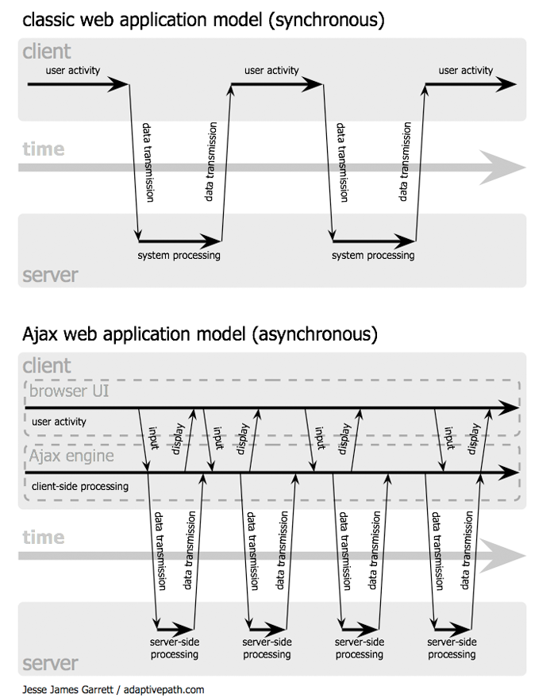

# Ajax: A New Approach to Web Applications
February 18, 2005 | By Jesse James Garrett

If anything about current interaction design can be called “glamorous,” it’s
creating Web applications. After all, when was the last time you heard someone
rave about the interaction design of a product that wasn’t on the Web? (Okay,
besides the iPod.) All the cool, innovative new projects are online.

Despite this, Web interaction designers can’t help but feel a little envious of
our colleagues who create desktop software. Desktop applications have a
richness and responsiveness that has seemed out of reach on the Web. The same
simplicity that enabled the Web’s rapid proliferation also creates a gap
between the experiences we can provide and the experiences users can get from a
desktop application.

That gap is closing. Take a look at Google Suggest. Watch the way the suggested
terms update as you type, almost instantly. Now look at Google Maps. Zoom in.
Use your cursor to grab the map and scroll around a bit. Again, everything
happens almost instantly, with no waiting for pages to reload.

Google Suggest and Google Maps are two examples of a new approach to web
applications that we at Adaptive Path have been calling Ajax. The name is
shorthand for Asynchronous JavaScript + XML, and it represents a fundamental
shift in what’s possible on the Web.

DEFINING AJAX Ajax isn’t a technology. It’s really several technologies, each
flourishing in its own right, coming together in powerful new ways. Ajax
incorporates:

- standards-based presentation using XHTML and CSS
- dynamic display and interaction using the Document Object Model
- data interchange and manipulation using XML and XSLT
- asynchronous data retrieval using XMLHttpRequest
- and JavaScript binding everything together.

The classic web application model works like this: Most user actions in the
interface trigger an HTTP request back to a web server. The server does some
processing — retrieving data, crunching numbers, talking to various legacy
systems — and then returns an HTML page to the client. It’s a model adapted
from the Web’s original use as a hypertext medium, but as fans of The Elements
of User Experience know, what makes the Web good for hypertext doesn’t
necessarily make it good for software applications.

*Figure 1: The traditional model for web applications (left) compared to the
Ajax model (right).*

This approach makes a lot of technical sense, but it doesn’t make for a great
user experience. While the server is doing its thing, what’s the user doing?
That’s right, waiting. And at every step in a task, the user waits some more.

Obviously, if we were designing the Web from scratch for applications, we
wouldn’t make users wait around. Once an interface is loaded, why should the
user interaction come to a halt every time the application needs something from
the server? In fact, why should the user see the application go to the server
at all?

HOW AJAX IS DIFFERENT An Ajax application eliminates the start-stop-start-stop
nature of interaction on the Web by introducing an intermediary — an Ajax
engine — between the user and the server. It seems like adding a layer to the
application would make it less responsive, but the opposite is true.

Instead of loading a webpage, at the start of the session, the browser loads an
Ajax engine — written in JavaScript and usually tucked away in a hidden frame.
This engine is responsible for both rendering the interface the user sees and
communicating with the server on the user’s behalf. The Ajax engine allows the
user’s interaction with the application to happen asynchronously — independent
of communication with the server. So the user is never staring at a blank
browser window and an hourglass icon, waiting around for the server to do
something.

*Figure 2: The synchronous interaction pattern of a traditional web application
(top) compared with the asynchronous pattern of an Ajax application (bottom).*

Every user action that normally would generate an HTTP request takes the form
of a JavaScript call to the Ajax engine instead. Any response to a user action
that doesn’t require a trip back to the server — such as simple data
validation, editing data in memory, and even some navigation — the engine
handles on its own. If the engine needs something from the server in order to
respond — if it’s submitting data for processing, loading additional interface
code, or retrieving new data — the engine makes those requests asynchronously,
usually using XML, without stalling a user’s interaction with the application.

WHO’S USING AJAX Google is making a huge investment in developing the Ajax
approach. All of the major products Google has introduced over the last year —
Orkut, Gmail, the latest beta version of Google Groups, Google Suggest, and
Google Maps — are Ajax applications. (For more on the technical nuts and bolts
of these Ajax implementations, check out these excellent analyses of Gmail,
Google Suggest, and Google Maps.) Others are following suit: many of the
features that people love in Flickr depend on Ajax, and Amazon’s A9.com search
engine applies similar techniques.

These projects demonstrate that Ajax is not only technically sound, but also
practical for real-world applications. This isn’t another technology that only
works in a laboratory. And Ajax applications can be any size, from the very
simple, single-function Google Suggest to the very complex and sophisticated
Google Maps.

At Adaptive Path, we’ve been doing our own work with Ajax over the last several
months, and we’re realizing we’ve only scratched the surface of the rich
interaction and responsiveness that Ajax applications can provide. Ajax is an
important development for Web applications, and its importance is only going to
grow. And because there are so many developers out there who already know how
to use these technologies, we expect to see many more organizations following
Google’s lead in reaping the competitive advantage Ajax provides.

MOVING FORWARD The biggest challenges in creating Ajax applications are not
technical. The core Ajax technologies are mature, stable, and well understood.
Instead, the challenges are for the designers of these applications: to forget
what we think we know about the limitations of the Web, and begin to imagine a
wider, richer range of possibilities.

It’s going to be fun.

## AJAX Q&A

March 13, 2005: Since we first published Jesse’s essay, we’ve received an
enormous amount of correspondence from readers with questions about Ajax. In
this Q&A, Jesse responds to some of the most common queries.

Q. Did Adaptive Path invent Ajax? Did Google? Did Adaptive Path help build
Google’s Ajax applications?

A. Neither Adaptive Path nor Google invented Ajax. Google’s recent products are
simply the highest-profile examples of Ajax applications. Adaptive Path was not
involved in the development of Google’s Ajax applications, but we have been
doing Ajax work for some of our other clients.

Q. Is Adaptive Path selling Ajax components or trademarking the name? Where can
I download it?

A. Ajax isn’t something you can download. It’s an approach — a way of thinking
about the architecture of web applications using certain technologies. Neither
the Ajax name nor the approach are proprietary to Adaptive Path.

Q. Is Ajax just another name for XMLHttpRequest?

A. No. XMLHttpRequest is only part of the Ajax equation. XMLHttpRequest is the
technical component that makes the asynchronous server communication possible;
Ajax is our name for the overall approach described in the article, which
relies not only on XMLHttpRequest, but on CSS, DOM, and other technologies.

Q. Why did you feel the need to give this a name?

A. I needed something shorter than “Asynchronous
JavaScript+CSS+DOM+XMLHttpRequest” to use when discussing this approach with
clients.

Q. Techniques for asynchronous server communication have been around for years.
What makes Ajax a “new” approach?

A. What’s new is the prominent use of these techniques in real-world
applications to change the fundamental interaction model of the Web. Ajax is
taking hold now because these technologies and the industry’s understanding of
how to deploy them most effectively have taken time to develop.

Q. Is Ajax a technology platform or is it an architectural style?

A. It’s both. Ajax is a set of technologies being used together in a particular
way.

Q. What kinds of applications is Ajax best suited for?

A. We don’t know yet. Because this is a relatively new approach, our
understanding of where Ajax can best be applied is still in its infancy.
Sometimes the traditional web application model is the most appropriate
solution to a problem.

Q. Does this mean Adaptive Path is anti-Flash?

A. Not at all. Macromedia is an Adaptive Path client, and we’ve long been
supporters of Flash technology. As Ajax matures, we expect that sometimes Ajax
will be the better solution to a particular problem, and sometimes Flash will
be the better solution. We’re also interested in exploring ways the
technologies can be mixed (as in the case of Flickr, which uses both).

Q. Does Ajax have significant accessibility or browser compatibility
limitations? Do Ajax applications break the back button? Is Ajax compatible
with REST? Are there security considerations with Ajax development? Can Ajax
applications be made to work for users who have JavaScript turned off?

A. The answer to all of these questions is “maybe”. Many developers are already
working on ways to address these concerns. We think there’s more work to be
done to determine all the limitations of Ajax, and we expect the Ajax
development community to uncover more issues like these along the way.

Q. Some of the Google examples you cite don’t use XML at all. Do I have to use
XML and/or XSLT in an Ajax application?

A. No. XML is the most fully-developed means of getting data in and out of an
Ajax client, but there’s no reason you couldn’t accomplish the same effects
using a technology like JavaScript Object Notation or any similar means of
structuring data for interchange.

Q. Are Ajax applications easier to develop than traditional web applications?

A. Not necessarily. Ajax applications inevitably involve running complex
JavaScript code on the client. Making that complex code efficient and bug-free
is not a task to be taken lightly, and better development tools and frameworks
will be needed to help us meet that challenge.

Q. Do Ajax applications always deliver a better experience than traditional web
applications?

A. Not necessarily. Ajax gives interaction designers more flexibility. However,
the more power we have, the more caution we must use in exercising it. We must
be careful to use Ajax to enhance the user experience of our applications, not
degrade it.

## Resources
- [Archived version of Ajax: A New Approach to Web Applications](https://web.archive.org/web/20151008003352/http://adaptivepath.org/ideas/ajax-new-approach-web-applications/)

